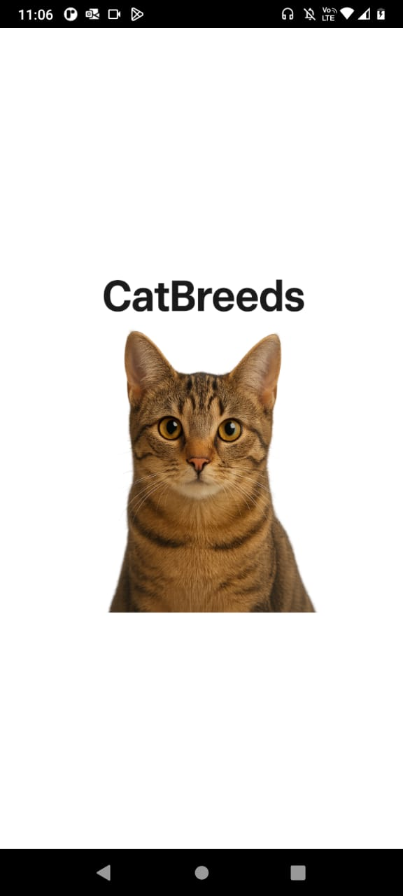
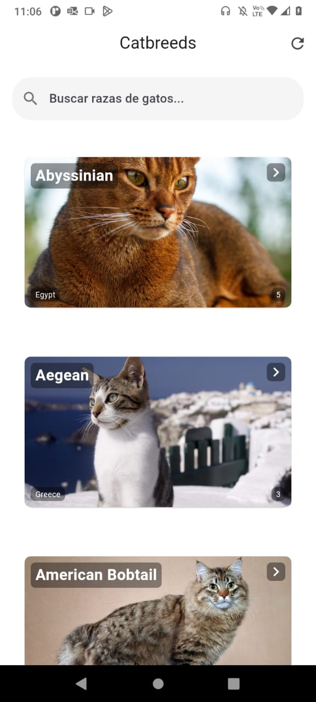
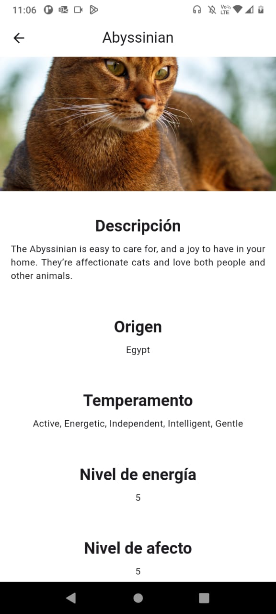

# pragma_prueba: Catsbreed

Prueba técnica.


---

## 🔑 Configuración de API Keys

Crea un archivo `.env` en la raíz del proyecto con el siguiente contenido:

```env
API_KEY=<tu_api_key_aqui>
```


## 📂 Estructura de carpetas

La organización del proyecto es la siguiente:


### 📝 Descripción rápida

- **models/** → Clases que representan entidades (ej. `CatBreed`).  
- **pages/** → Pantallas principales de la app.  
  - **widgets/** → Conjunto de componentes personalizados multiplataforma (cupertino activity indicator, circular progress indicator, appbar, cupertino navigation bar, etc).  
- **services/** → Servicios que interactúan con APIs (ej. The Cat API).  
- **theme/** → Definición de colores, tipografías y estilos globales.  
- **main.dart** → Archivo principal que arranca la aplicación.  
 


## 📸 Screenshots

Aquí puedes ver algunas capturas de pantalla de la aplicación:

### Pantalla de splash


### Pantalla de landing


### Ejemplo de vista de detalle
